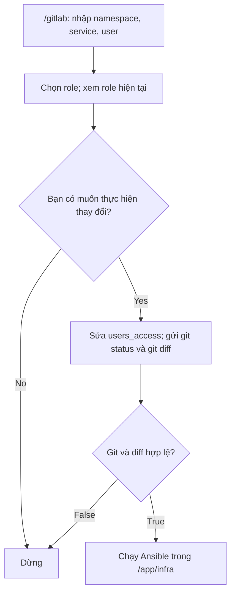

# Luồng /gitlab

Triển khai dựa trên commit `90a5959` của `tuanphi/infra-bot`, dùng cấu trúc
file `gitlab-ghub(1)` đã cung cấp. Các file mới là `gitlab_access.py` và
`gitlab_conversation.py`; `bot.py`, `runtime.py`, `Dockerfile` và
`requirements.txt` tích hợp luồng mới. Luồng `/run <source-branch>` vẫn có thể dùng.

## Hội thoại



1. `/gitlab` → bot hiển thị **Nhập tên namespace**.
2. Nhập `ghub-website` → bot kiểm tra namespace, hiển thị **Nhập tên service**.
3. Nhập `merchant-portal-client` → bot kiểm tra service, hiển thị **Nhập tên user**.
4. Nhập `tuanpv` → bot hiển thị **Chọn role**, với bốn nút:
   `maintainer`, `developer`, `reporter`, `guest`. Mỗi yêu cầu chọn một role.
5. Chọn `developer` → bot đọc đúng service trong YAML, hiển thị:

   ```text
   user tuanpv chưa có role
   Namespace: ghub-website
   Service: merchant-portal-client
   Role được chọn: developer

   Bạn có muốn thực hiện thay đổi?
   [Yes] [No]
   ```

   Nếu đã có quyền, dòng đầu là `user tuanpv đang có role developer`
   hoặc role hiện tại tương ứng. Thông tin này lấy từ YAML của service đó;
   trạng thái quyền trên GitLab thật cần được đồng bộ qua playbook.

6. Chọn **No** hoặc gửi `/cancel` → dừng, chưa sửa file/chạy Ansible.
7. Chọn **Yes** → backend sửa YAML, gửi đầy đủ output của `git status`
   và `git diff group_vars/gitlab-ghub`, rồi chạy Ansible nếu kiểm tra hợp lệ.

Chỉ Telegram user thuộc `ALLOWED_USER_IDS`, trong `ALLOWED_GROUP_ID`, mới được
đi qua luồng. Nút của người khác, nút của phiên cũ hoặc nút đã xác nhận không
thể áp dụng lại yêu cầu. `/gitlab` có thể khởi tạo lại phiên trước khi xác nhận.
Sau Yes, tác vụ chạy riêng và không bị hủy bởi `/cancel`.

## Tìm namespace và service

| Đầu vào | Trường dùng để đối chiếu |
| --- | --- |
| Namespace | `gitlab_groups[].path` và key `gitlab_projects.<namespace>` |
| Service | Phần cuối `gitlab_projects.<namespace>.project[].path` |
| Đường dẫn project | `<gitlab_groups[].parent>/<namespace>/<service>` |
| User và role | `users_access[].users` và `users_access[].level` của project đã tìm |

Đối chiếu chính xác; không tìm theo chuỗi con hoặc tên hiển thị `project.name`.
Ví dụ `api-gateway` ở `ghub-customer` và `ghub-connector` là hai service khác nhau.
Không tìm thấy, trùng đường dẫn project, YAML trùng key hoặc dùng alias: dừng với
thông báo lỗi. Bốn role phải có sẵn; `users` dùng inline list như file cung cấp.

## Sửa YAML và xác minh Git

Trước khi sửa, repo phải ở branch `master`, có working tree/index sạch, có các
file thường `group_vars/gitlab-ghub`, `nonprod` và `gitlab-repos-ghub.yaml`.
Repo, commit và nội dung file được kiểm tra lại sau khi user chọn Yes.

- User chưa có role: thêm vào danh sách của role đã chọn.
- User đang có role khác: bỏ khỏi role cũ trong service này, thêm vào role mới.
- User đã có đúng role: không tạo diff và dừng trước Ansible.
- User nằm ở nhiều role trong cùng service: sau thay đổi chỉ giữ role đã chọn.

Chỉ các giá trị danh sách `users` cần thay đổi được thay thế. Comment bên ngoài
những danh sách này, thụt lề, dấu nháy và mọi nội dung khác giữ nguyên.

Ví dụ diff khi thêm `tuanpv`:

```diff
             - level: developer
-            users: ["anhtn", "trung"]
+            users: ["anhtn", "trung", "tuanpv"]
```

Backend yêu cầu đồng thời:

1. Branch vẫn là `master`, HEAD vẫn là commit đã dùng để xem role.
2. `git status --porcelain=v1 -z --untracked-files=all` chỉ có
   ` M group_vars/gitlab-ghub`; không có file staged, untracked hoặc file khác.
3. Diff có nội dung; file trên đĩa khớp bản sửa được tính từ yêu cầu đã xác nhận.
4. Cấu trúc YAML sau sửa chỉ đổi membership của đúng user trong service đã chọn.

Bot gửi toàn bộ hai output Git dưới dạng text thường, chia tin theo giới hạn
Telegram nếu cần. Không cắt ngắn hai output này. Máy dùng dữ liệu porcelain và
so sánh nội dung để kiểm tra, không phụ thuộc cách diễn đạt của `git status`.

Kiểm tra False: dừng trước Ansible. Nếu đã sửa file, backend phục hồi riêng bản
sửa của lượt hiện tại khi file vẫn khớp bản bot đã ghi. Thay đổi khác của người
vận hành được giữ nguyên. Không dùng `git reset --hard`.

## Chạy playbook và giữ kết quả

Backend kiểm tra lại ngay trước khi gọi subprocess, với thư mục làm việc là
`GIT_CLONE_DIR` (mặc định `/app/infra`) và argv cố định:

```bash
ansible-playbook -i nonprod gitlab-repos-ghub.yaml --tags=ghub-website,project_user_access
```

`ghub-website` được thay bằng namespace đã chọn. Không ghép shell command từ
nội dung người dùng. Một khóa dùng chung với `/run` chỉ cho phép một lượt
Ansible trong một process; dùng một replica cho Telegram polling.

`--tags=namespace,project_user_access` chọn task khớp **một trong hai** tag;
phạm vi thực thi còn phụ thuộc cách gắn tag/include/role trong playbook.
Cần kiểm tra `gitlab-repos-ghub.yaml` và các task của repo infra để xác nhận
phạm vi quyền thực tế. Tham khảo
[Ansible: Selecting or skipping tags](https://docs.ansible.com/projects/ansible-core/2.13/user_guide/playbooks_tags.html#selecting-or-skipping-tags-when-you-run-a-playbook).

Ansible exit 0: bot gửi kết quả và PLAY RECAP nếu có. Exit khác 0 hoặc timeout:
bot báo lỗi và giữ diff để kiểm tra vì playbook có thể đã áp dụng một phần.

Sau khi chạy, file YAML giữ thay đổi chưa commit. Người vận hành cần xử lý
diff này bằng quy trình Git hiện có trước lượt `/gitlab` tiếp theo hoặc trước
khi khởi động lại bot. Bảy bước này kết thúc ở chạy Ansible; việc commit/push/MR
không được tự bổ sung vào luồng.

## Cài vào infra-bot

Giải nén gói ZIP rồi áp dụng patch tại thư mục gốc infra-bot:

```bash
git apply --check /path/to/infra-bot-gitlab.patch
git apply /path/to/infra-bot-gitlab.patch
docker build -t infra-ansible-bot:gitlab-flow .
```

Giữ các biến hiện có trong `/mnt/secrets/.env`; đặt:

```dotenv
GIT_TARGET_BRANCH=master
GIT_CLONE_DIR=/app/infra
```

Hai module mới được COPY vào image và PyYAML 6.0.1 được cài từ requirements.
Các biến xác thực GitLab và Telegram vẫn dùng cấu hình hiện tại. Không cần biến
môi trường mới cho luồng `/gitlab`.

Startup clone trên branch đã cấu hình; checkout hiện có được cập nhật bằng
checkout branch và merge `--ff-only`, thay cho detached HEAD. Repo có diff
local vẫn dừng startup để giữ dữ liệu; branch phân kỳ dừng thay vì reset commit.
HTTP `/health` giữ hành vi hiện có.

## Kiểm chứng

```bash
python -m pip install 'python-telegram-bot==20.7' 'PyYAML==6.0.1'
python -m unittest discover -s tests -v
```

Test dùng Git thật trong repo tạm, executable Ansible giả để ghi argv/cwd, và
Bot API giả trong bộ nhớ. Bao gồm nhánh Yes/No, các role, chuyển role, nút cũ,
người khác bấm nút, quyền Telegram, khóa chạy chung, diff ngoài dự kiến,
thay đổi sau preview, startup branch và regression của `/run`.
Không kết nối Telegram/GitLab thật hoặc chạy playbook infra thật trong kiểm thử.
Việc áp dụng quyền lên GitLab còn cần kiểm tra tại container của bạn.
