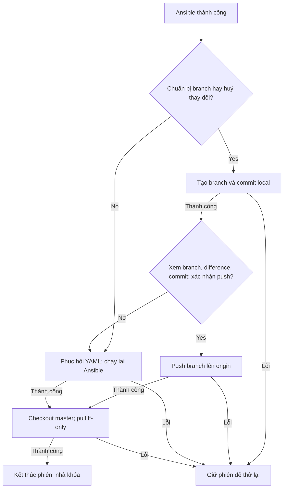

# Luồng /gitlab

Tài liệu mô tả luồng `/gitlab` với quyết định Yes/No sau Ansible và xác nhận
thông tin branch trước khi push và tra role qua GitLab REST API, dựa trên source
`master` ở commit `a8f9abb` của
`tuanphi/infra-bot`. Các lệnh chuyển nhánh dùng `git checkout` để tương thích
với Git trong container chưa hỗ trợ `git switch`.
`gitlab_conversation.py` quản lý hội thoại; `gitlab_access.py` sửa YAML, chạy
playbook và hoàn tất thay đổi; `workflow.py` cung cấp Git helper và GitLab
client đọc membership. `/gitlab` chỉ push branch; API tạo MR chỉ còn dùng bởi
`/run`. Luồng `/run <source-branch>` vẫn dùng source đã commit/push từ trước.

## Hội thoại



1. `/gitlab` → bot hiển thị **Nhập tên namespace**.
2. Nhập `ghub-website` → bot kiểm tra namespace, hiển thị **Nhập tên service**.
3. Nhập `merchant-portal-client` → bot kiểm tra service, hiển thị **Nhập tên user**.
4. Nhập `tuanpv` → bot hiển thị **Chọn role**, với bốn nút:
   `maintainer`, `developer`, `reporter`, `guest`. Mỗi yêu cầu chọn một role.
5. Chọn `developer` → bot lấy path của service từ YAML, tra user và
   membership qua GitLab REST API, hiển thị ví dụ:

   ```text
   user tuanpv đang có role reporter (GitLab API)
   User ID: 123
   Project: development/ghub-website/merchant-portal-client
   access_level: 20
   expires_at: none
   Namespace: ghub-website
   Service: merchant-portal-client
   Role được chọn: developer

   Bạn có muốn thực hiện thay đổi?
   [Yes] [No]
   ```

   Role hiện tại lấy từ API tại thời điểm chọn role, bao gồm membership kế thừa
   từ group mà token được phép xem. User tồn tại nhưng không có membership
   được hiển thị là `user tuanpv chưa có membership trong project (GitLab API)`.
   Không tìm thấy user hoặc API lỗi: dừng trước menu xác nhận và sửa YAML.

6. Chọn **No** hoặc gửi `/cancel` → dừng, chưa sửa file/chạy Ansible.
7. Chọn **Yes** → backend sửa YAML, gửi đầy đủ output của `git status`
   và `git diff group_vars/gitlab-ghub`, rồi chạy Ansible nếu kiểm tra hợp lệ.
8. Ansible exit 0 → bot gửi kết quả và PLAY RECAP, sau đó hiển thị:

   ```text
   Yes: Tạo và đẩy branch lên repo / No: Huỷ thay đổi
   ```

   Tin nhắn có hai nút **Yes** và **No**. Đây là quyết định sau khi quyền đã
   được áp dụng qua playbook, khác bước xác nhận trước khi chạy Ansible.
9. **Yes** → tạo branch và commit riêng file YAML tại local, rồi hiển thị
   **Thông tin branch trước khi push** gồm branch, difference, commit SHA và commit message.
   **No** → phục hồi YAML trước khi sửa và chạy lại cùng playbook/cùng namespace.
10. Sau thông tin branch, bot hỏi **Bạn có muốn đẩy branch lên repo không?**
    với hai nút Yes/No. Yes mới cho phép push branch lên `origin`; không tạo MR.
    No chuyển sang cùng backend huỷ thay đổi ở bước 9, kể cả khi đã tạo commit local.
11. Sau khi hoàn tất lựa chọn, bot chạy `git checkout master` và
    `git pull --ff-only origin master`, gửi kết quả, xoá phiên và nhả khóa.

Chỉ Telegram user thuộc `ALLOWED_USER_IDS`, trong `ALLOWED_GROUP_ID`, mới được
đi qua luồng. Nút của người khác, nút của phiên cũ hoặc nút đã xác nhận không
thể áp dụng lại yêu cầu. Phiên được đối chiếu theo chat, user, nonce và message ID.
Ba bước xác nhận dùng callback riêng: trước Ansible là `:confirm:`, sau
Ansible là `:final:`, và xác nhận push sau khi xem thông tin branch là `:push:`.

`/gitlab` có thể khởi tạo lại phiên trước khi xác nhận. Sau khi xác nhận Yes
lần đầu, `/cancel` không huỷ tác vụ đang chạy. Khi đang chờ quyết định sau
Ansible hoặc xác nhận push,
`/gitlab` hoặc `/cancel` của người mở phiên hiển thị lại menu; khi backend đang
xử lý, bot yêu cầu chờ. Menu được gửi lại làm nút trên menu trước đó hết hiệu lực.

## Tìm namespace và service

| Đầu vào | Trường dùng để đối chiếu |
| --- | --- |
| Namespace | `gitlab_groups[].path` và key `gitlab_projects.<namespace>` |
| Service | Phần cuối `gitlab_projects.<namespace>.project[].path` |
| Đường dẫn project | `<gitlab_groups[].parent>/<namespace>/<service>` |
| User ID | REST API `GET /users?username=<username>` |
| Role hiện tại | REST API `GET /projects/<encoded-project-path>/members/all/<user-id>` |
| Cấu hình role cần sửa | `users_access[].users` và `users_access[].level` trong YAML |

Đối chiếu chính xác; không tìm theo chuỗi con hoặc tên hiển thị `project.name`.
Ví dụ `api-gateway` ở `ghub-customer` và `ghub-connector` là hai service khác nhau.
Không tìm thấy, trùng đường dẫn project, YAML trùng key hoặc dùng alias: dừng với
thông báo lỗi. Bốn role phải có sẵn; `users` dùng inline list như file cung cấp.

## Kiểm tra role bằng GitLab REST API

`GitLabClient.project_user_access()` dùng `GITLAB_URL` và header
`PRIVATE-TOKEN: GITLAB_TOKEN`, timeout 30 giây mỗi request:

1. `GET /api/v4/users?username=tuanpv`: khớp username chính xác, không phân biệt
   hoa/thường; lấy ID, username chuẩn và tên user. Danh sách rỗng: báo không tìm
   thấy user, không hiểu thành user chưa có quyền trong project.
2. `GET /api/v4/projects/development%2Fghub-website%2Fmerchant-portal-client/members/all/<USER_ID>`:
   URL-encode toàn bộ `project.path` với `quote(path, safe="")`, lấy `access_level`
   và `expires_at`. Không dùng `GITLAB_PROJECT_ID` của repo Ansible để tra role service.
3. Nếu membership trả HTTP 404, bot gọi thêm `GET /api/v4/projects/<encoded-path>`.
   Chỉ khi project đọc được mới kết luận không có membership. Project 404/403,
   token 401, lỗi mạng/CA/timeout hoặc JSON sai đều dừng với thông báo lỗi;
   không lấy role từ YAML làm kết quả thay thế.

| access_level | Role hiển thị |
| --- | --- |
| 0 | no access |
| 5 | minimal access |
| 10 | guest |
| 15 | planner (nếu GitLab hỗ trợ) |
| 20 | reporter |
| 25 | security manager (nếu GitLab hỗ trợ) |
| 30 | developer |
| 40 | maintainer |
| 50 | owner |

Mức khác được hiển thị `unknown (<access_level>)`, giữ nguyên mã API trả về.
Planner/Owner và các mức khác chỉ phục vụ hiển thị; bốn nút role để ghi YAML
vẫn là maintainer/developer/reporter/guest. API này chỉ đọc; thay đổi quyền
vẫn do playbook thực hiện. `members/all` phản ánh quyền membership kế thừa,
không chứng minh nguồn cấp quyền là entry trực tiếp của project.

Tham khảo [Users API](https://docs.gitlab.com/api/users/) và
[Project members API](https://docs.gitlab.com/api/project_members/).

## Sửa YAML và xác minh Git

Trước khi sửa, repo phải ở branch `master`, có working tree/index sạch, có các
file thường `group_vars/gitlab-ghub`, `nonprod` và `gitlab-repos-ghub.yaml`.
Repo, commit và nội dung file được kiểm tra lại sau khi user chọn Yes.

- User chưa có trong YAML: thêm vào danh sách của role đã chọn.
- User đang ở role khác trong YAML: bỏ khỏi danh sách đó, thêm vào role mới.
- YAML đã có user ở đúng role và không cần đổi danh sách nào: không tạo diff,
  dừng trước Ansible. Thông báo nêu rõ đây là trạng thái YAML; nếu API khác YAML,
  cần đồng bộ bằng playbook. Role API giống role chọn nhưng YAML khác vẫn có thể
  tạo diff để cập nhật cấu hình.
- User nằm ở nhiều role trong YAML của cùng service: sau thay đổi chỉ giữ role đã chọn.

Chỉ các giá trị danh sách `users` cần thay đổi được thay thế. Comment bên ngoài
những danh sách này, thụt lề, dấu nháy và mọi nội dung khác giữ nguyên.

Ví dụ diff khi thêm `tuanpv`:

```diff
             - level: developer
-            users: ["anhtn", "trung"]
+            users: ["anhtn", "trung", "tuanpv"]
```

Backend yêu cầu đồng thời:

1. Branch vẫn là `master`, HEAD vẫn là commit đã dùng để xem role.
2. `git status --porcelain=v1 -z --untracked-files=all` chỉ có
   ` M group_vars/gitlab-ghub`; không có file staged, untracked hoặc file khác.
3. Diff có nội dung; file trên đĩa khớp bản sửa được tính từ yêu cầu đã xác nhận.
4. Cấu trúc YAML sau sửa chỉ đổi membership của đúng user trong service đã chọn.

Bot gửi toàn bộ hai output Git dưới dạng text thường, chia tin theo giới hạn
Telegram nếu cần. Không cắt ngắn hai output này. Máy dùng dữ liệu porcelain và
so sánh nội dung để kiểm tra, không phụ thuộc cách diễn đạt của `git status`.

Kiểm tra False: dừng trước Ansible. Nếu đã sửa file, backend phục hồi riêng bản
sửa của lượt hiện tại khi file vẫn khớp bản bot đã ghi. Thay đổi khác của người
vận hành được giữ nguyên. Không dùng `git reset --hard`.

## Chạy playbook và giữ kết quả

Backend kiểm tra lại ngay trước khi gọi subprocess, với thư mục làm việc là
`GIT_CLONE_DIR` (mặc định `/app/infra`) và argv cố định:

```bash
ansible-playbook -i nonprod gitlab-repos-ghub.yaml --tags=ghub-website,project_user_access
```

`ghub-website` được thay bằng namespace đã chọn. Không ghép shell command từ
nội dung người dùng. Khóa `run_lock` dùng chung với `/run` được giữ từ lúc
xác nhận Yes lần đầu, qua chạy Ansible, chờ quyết định sau Ansible, xem thông
tin branch, chờ xác nhận push và hoàn tất lựa chọn.
Trong thời gian này, lượt `/run` hoặc `/gitlab` khác không thể sử dụng repo.
Chỉ triển khai một replica cho Telegram polling; khóa này chỉ có hiệu lực
trong một process.

`--tags=namespace,project_user_access` chọn task khớp **một trong hai** tag;
phạm vi thực thi còn phụ thuộc cách gắn tag/include/role trong playbook.
Cần kiểm tra `gitlab-repos-ghub.yaml` và các task của repo infra để xác nhận
phạm vi quyền thực tế. Tham khảo
[Ansible: Selecting or skipping tags](https://docs.ansible.com/projects/ansible-core/2.13/user_guide/playbooks_tags.html#selecting-or-skipping-tags-when-you-run-a-playbook).

Ansible exit 0: bot gửi kết quả và PLAY RECAP nếu có, giữ bản YAML đã sửa và
phiên hiện tại để chờ quyết định cuối. Tác vụ nền kết thúc sau khi gửi menu;
khóa vẫn do phiên giữ, không cần một task chờ vô hạn.

Ansible lần đầu exit khác 0 hoặc timeout: bot báo lỗi, giữ diff để kiểm tra vì
playbook có thể đã áp dụng một phần, kết thúc phiên và nhả khóa. Trường hợp
này không hiện menu push branch/huỷ thay đổi và cần người vận hành kiểm tra trước
lượt `/gitlab` tiếp theo.

## Quyết định No sau Ansible

Backend chỉ phục hồi khi branch/commit và file còn khớp bản sửa của lượt hiện
tại. Nếu người vận hành đã sửa file hoặc thêm thay đổi ngoài dự kiến, bot dừng
và giữ dữ liệu để kiểm tra.

Thứ tự xử lý:

1. Nếu đã tạo branch/commit local để xem thông tin branch, kiểm tra bản nháp còn nguyên và
   local `master` vẫn ở commit đã preview, rồi `git checkout master` để lấy
   lại YAML gốc. Nếu chuẩn bị dừng sau `git add`, backend bỏ staging riêng file
   YAML và phục hồi nội dung trước khi checkout; không reset toàn repo.
2. Phục hồi chính xác nội dung `group_vars/gitlab-ghub` trước khi sửa, lấy từ
   `change.request.source`, hoặc xác minh file đã khớp bản đó sau checkout.
   Giữ user/role cũ của service.
3. Chạy lại `ansible-playbook -i nonprod gitlab-repos-ghub.yaml
   --tags=<namespace>,project_user_access` trong `/app/infra`.
4. Khi Ansible exit 0, đánh dấu đã chạy phục hồi, rồi checkout `master` và pull
   fast-forward.
5. Gửi thông báo đã phục hồi YAML, chạy lại Ansible với cấu hình cũ và cập nhật
   `master`; kết thúc phiên.

Nếu Ansible phục hồi thất bại, YAML cũ vẫn được giữ, phiên và khóa vẫn còn;
bot hiện nút **No** để thử lại. Nếu Ansible đã thành công nhưng pull lỗi, lần
thử lại chỉ tiếp tục bước cập nhật `master`.

No sau Ansible và No tại menu xác nhận push đều gọi `_cancel_change()`.
Branch/commit đã chuẩn bị được giữ tại local để kiểm tra; lượt bị huỷ không
push branch. Nếu local `master` hoặc bản nháp bị thay đổi
ngoài dự kiến, backend báo lỗi và giữ dữ liệu để người vận hành kiểm tra.

Phục hồi YAML và Ansible exit 0 không tự chứng minh membership trên GitLab đã
trở về trạng thái cũ. Playbook cần xử lý việc thu hồi user bị loại khỏi YAML
và đổi lại role cũ; đặc biệt phải kiểm tra trường hợp user ban đầu chưa có quyền.
No phục hồi snapshot YAML, không ghi lại quyền trực tiếp qua API. Nếu role API
ban đầu khác YAML, No áp dụng YAML cũ và không đảm bảo trở về đúng role API
ban đầu; quyền kế thừa từ group cũng không bị giảm bởi việc sửa membership project.

## Yes sau Ansible: chuẩn bị branch và commit

Backend kiểm tra lại Git và nội dung file trước khi tạo branch/commit bằng
`prepare_branch()`. Bước này trả `BranchPushInfo` cho hội thoại và
chờ người dùng xác nhận push.
Tên branch dùng thời gian UTC+7:

```text
<year>-<month>-<day>-<hour>-<minute>/<namespace>-<service>
2026-10-08-13-30/ghub-website-merchant-portal-client
```

Branch phải hợp lệ và chưa tồn tại ở local hoặc origin. Nếu trùng trong cùng
phút, bot báo lỗi; có thể bấm Yes lại ở phút kế tiếp.

Commit chỉ chứa `group_vars/gitlab-ghub`, với thông điệp:

```text
gitlab-repo: Grant role <role> for <user> to repo <namespace>/<service>
gitlab-repo: Grant role developer for tuanpv to repo ghub-website/merchant-portal-client
```

Các lệnh Git chuẩn bị tại local tương ứng:

```bash
git checkout -b <branch>
git add -- group_vars/gitlab-ghub
git commit -m "gitlab-repo: Grant role <role> for <user> to repo <namespace>/<service>" -- group_vars/gitlab-ghub
```

Lệnh commit đặt `user.name` riêng bằng `GITLAB_USERNAME` (fallback `infra-bot`)
và `user.email=<author>@<GitLab host>` qua `git -c`; không cần cấu hình author
toàn cục trong container. Push dùng credential helper hiện có, không force push.

## Thông tin branch và xác nhận push

Bot gửi đầy đủ thông tin, chia thành nhiều tin nhắn nếu vượt giới hạn Telegram:

```text
Thông tin branch trước khi push
Branch: 2026-10-08-13-30/ghub-website-merchant-portal-client
Commit: <commit SHA>
Commit message: gitlab-repo: Grant role developer for tuanpv to repo ghub-website/merchant-portal-client

Difference:
<git diff của file group_vars/gitlab-ghub>
```

Difference được lấy từ `git diff <commit trước thay đổi> <commit đã chuẩn bị>
-- group_vars/gitlab-ghub`, không lấy working-tree diff vốn đã rỗng sau commit.
Commit phải có parent là commit đã preview và chỉ đổi đúng file YAML; branch,
working tree và nội dung file được kiểm tra trước khi hiển thị.

Sau thông tin, bot hiện:

```text
Bạn có muốn đẩy branch lên repo không?
Yes: Push branch / No: Huỷ thay đổi
```

- **Yes:** kiểm tra lại branch, diff, SHA và commit message khớp chính xác
  `BranchPushInfo` đã hiển thị; đánh dấu đã xác nhận push rồi mới push branch.
- **No:** gọi cùng luồng phục hồi YAML/chạy lại Ansible như No sau Ansible.

Các bước sau xác nhận Yes tương ứng:

```bash
git push --set-upstream origin <branch>
git checkout master
git pull --ff-only origin master
```

`_publish_change()` kiểm tra thông tin đã duyệt, chạy `git push --set-upstream`
và checkout/pull về `master`. Không gọi `create_or_get_mr()` trong `/gitlab`.
Thành công: bot gửi branch, commit, xoá phiên và nhả khóa. Branch remote được giữ
để người vận hành xử lý tiếp; không có MR tự động và không có thay đổi trực tiếp
vào `master`. Checkout/pull không chạy lại Ansible và không huỷ quyền đã áp dụng.
Cần đồng bộ YAML trong `master` trước lượt tiếp theo cho cùng service.

Các tên trong backend: `prepare_branch()` chuẩn bị branch/commit;
`branch_push_info()` trả `BranchPushInfo`; `finalize()` nhận change, lựa chọn,
trạng thái và bản thông tin đã duyệt. `show_branch_review()` trong hội thoại
hiển thị bản này; phiên lưu ở `push_preview`.

## Lỗi cuối luồng và thử lại

`Finalization` giữ `action`, `branch`, `commit`, `push_confirmed`, `pushed`,
`restored` trong phiên để tiếp tục từ bước đã hoàn tất.
`BranchPushInfo` giữ branch, difference, SHA và commit message đã hiển thị.

| Tình huống | Xử lý khi thử lại |
| --- | --- |
| Chuẩn bị branch/commit lỗi, chưa xác nhận push | Thử lại Yes để chuẩn bị/xem branch, hoặc No để phục hồi. |
| Đã tạo commit, đang chờ xác nhận push | Giữ khóa; Yes push branch hoặc No chạy luồng huỷ. |
| Đã xác nhận push nhưng push lỗi | Giữ branch/commit và thông tin đã duyệt; thử lại Yes để push branch. |
| Branch đã push nhưng checkout/pull lỗi | Giữ branch/commit remote; thử lại cập nhật `master`, không push lại. |
| No đã phục hồi YAML nhưng Ansible lỗi | Chạy lại playbook với YAML cũ. |
| No đã chạy lại Ansible thành công nhưng pull lỗi | Thử lại cập nhật `master`, không chạy lại playbook. |
| Repo bị sửa ngoài dự kiến | Báo lỗi; giữ dữ liệu, không reset hoặc ghi đè thay đổi khác. |

Lỗi ở bước hoàn tất giữ phiên và khóa. Trước khi xác nhận push, người dùng vẫn
có thể chọn No dù đã tạo branch/commit local. Khi đã xác nhận push và bắt đầu
xử lý remote, bot chỉ hiện **Yes** để thử lại cùng thông tin đã duyệt; khi đã
bắt đầu phục hồi, bot chỉ hiện **No** để thử lại. Nếu menu bị mất hoặc gửi
Telegram lỗi, `/gitlab` hoặc `/cancel` của người mở phiên hiển thị lại menu
phù hợp; ở bước xem branch, bot gửi lại cả thông tin và nút xác nhận push.

Phiên và trạng thái thử lại nằm trong bộ nhớ, không được phục hồi sau restart.
Checkout có thay đổi local vẫn làm startup dừng để giữ dữ liệu. Khi bị gián
đoạn giữa commit/push, cần kiểm tra branch, remote và quyền thực tế trước
khi tiếp tục; không giả định bot tự khôi phục phiên cũ.

## Cài vào infra-bot

Đưa các thay đổi code vào `gitlab_access.py`, `gitlab_conversation.py` và
`workflow.py`, rồi build image tại thư mục gốc infra-bot:

```bash
docker build -t infra-ansible-bot:gitlab-role-mr .
```

Giữ các biến hiện có trong `/mnt/secrets/.env`; đặt:

```dotenv
GIT_TARGET_BRANCH=master
GIT_CLONE_DIR=/app/infra
GITLAB_PROJECT_ID=devops/ansible/infra
```

Các module đã được COPY vào image và PyYAML 6.0.1 được cài từ requirements.
Giữ cấu hình xác thực GitLab/Telegram hiện có; token cần quyền đọc/push repo
Ansible và quyền API tìm/tạo MR trong project đó; đồng thời cần quyền đọc user,
project service và membership để tra role. API Python dùng trust store TLS
của Python/container; `GIT_SSL_CAINFO` chỉ cấu hình Git, không cấu hình urllib.
Không cần biến môi trường mới cho bước tra role hoặc quyết định cuối. `/mnt/secrets/.env` vẫn được Python nạp khi startup.

Startup clone trên branch đã cấu hình; checkout hiện có được cập nhật bằng
checkout branch và merge `--ff-only`, thay cho detached HEAD. Repo có diff
local vẫn dừng startup để giữ dữ liệu; branch phân kỳ dừng thay vì reset commit.
HTTP `/health` giữ hành vi hiện có.

## Kiểm chứng

Luồng `/gitlab` chỉ push branch đã qua 27 kiểm tra local dùng Git thật,
role API/Ansible/Telegram mô phỏng. Bao gồm ba menu xác nhận, chưa push trước
duyệt, branch/commit đúng mẫu, remote trỏ đúng commit, No sau commit local,
diff đầy đủ, Git không hỗ trợ `switch`, lỗi push/checkout/pull và thử lại,
bảo vệ thay đổi khác, nút cũ/người khác và khóa phiên. Trong các kiểm tra này,
`create_or_get_mr()` được đặt để báo lỗi nếu gọi; số lời gọi thực tế bằng 0.

Năm kiểm tra `/run`/MR hiện có cũng qua. Cú pháp Python 3.8 đã được kiểm tra,
runtime kiểm tra local dùng Python 3.12. Chưa xác minh trên GitLab nội bộ thật.

Kiểm tra tại container trên service thử nghiệm:

1. No trước Ansible: file và quyền không thay đổi.
2. Yes trước Ansible: kiểm tra Git status/diff, argv và PLAY RECAP.
3. Yes sau Ansible: kiểm tra branch/commit local và toàn bộ difference được
   hiển thị; branch chưa có trên remote.
4. Yes xác nhận push: kiểm tra branch remote trỏ đúng commit đã xem, working
   tree sạch và `master` đã checkout/pull; xác nhận không gọi API tạo MR.
5. No sau Ansible hoặc No tại menu push: kiểm tra YAML cũ có trước khi chạy
   lại playbook, role cũ được
   phục hồi; user ban đầu chưa có quyền phải được thu hồi membership mới.
6. Kiểm tra nút cũ/người khác, `/gitlab` và `/cancel` khi chờ quyết định/xác
   nhận push, cùng
   việc `/run` bị chặn trong thời gian đó.
7. Mô phỏng lỗi chuẩn bị commit, push, checkout/pull hoặc playbook phục
   hồi; kiểm tra nút thử lại,
   không tạo thêm commit hoặc push lại sau khi đã push thành công và chỉ nhả khóa sau khi hoàn tất.
