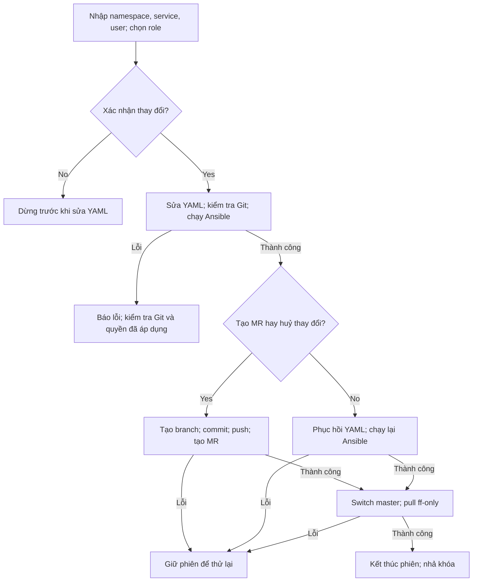

# Luồng /gitlab

Tài liệu mô tả luồng `/gitlab` đã bổ sung quyết định Yes/No sau Ansible, dựa
trên source `master` ở commit `456df3a` của `tuanphi/infra-bot`.
`gitlab_conversation.py` quản lý hội thoại; `gitlab_access.py` sửa YAML, chạy
playbook và hoàn tất thay đổi; `workflow.py` cung cấp Git helper và GitLab MR
client. Luồng `/run <source-branch>` vẫn dùng source đã commit/push từ trước.

## Hội thoại



1. `/gitlab` → bot hiển thị **Nhập tên namespace**.
2. Nhập `ghub-website` → bot kiểm tra namespace, hiển thị **Nhập tên service**.
3. Nhập `merchant-portal-client` → bot kiểm tra service, hiển thị **Nhập tên user**.
4. Nhập `tuanpv` → bot hiển thị **Chọn role**, với bốn nút:
   `maintainer`, `developer`, `reporter`, `guest`. Mỗi yêu cầu chọn một role.
5. Chọn `developer` → bot đọc đúng service trong YAML, hiển thị:

   ```text
   user tuanpv chưa có role
   Namespace: ghub-website
   Service: merchant-portal-client
   Role được chọn: developer

   Bạn có muốn thực hiện thay đổi?
   [Yes] [No]
   ```

   Nếu đã có quyền, dòng đầu là `user tuanpv đang có role developer`
   hoặc role hiện tại tương ứng. Thông tin này lấy từ YAML của service đó;
   trạng thái quyền trên GitLab thật cần được đồng bộ qua playbook.

6. Chọn **No** hoặc gửi `/cancel` → dừng, chưa sửa file/chạy Ansible.
7. Chọn **Yes** → backend sửa YAML, gửi đầy đủ output của `git status`
   và `git diff group_vars/gitlab-ghub`, rồi chạy Ansible nếu kiểm tra hợp lệ.
8. Ansible exit 0 → bot gửi kết quả và PLAY RECAP, sau đó hiển thị:

   ```text
   Yes: Tạo merge request đẩy lên nhánh master / No: Huỷ thay đổi
   ```

   Tin nhắn có hai nút **Yes** và **No**. Đây là quyết định sau khi quyền đã
   được áp dụng qua playbook, khác bước xác nhận trước khi chạy Ansible.
9. **Yes** → tạo branch, commit riêng file YAML, push và tìm/tạo MR vào `master`.
   **No** → phục hồi YAML trước khi sửa và chạy lại cùng playbook/cùng namespace.
10. Sau khi hoàn tất lựa chọn, bot chạy `git switch master` và
    `git pull --ff-only origin master`, gửi kết quả, xoá phiên và nhả khóa.

Chỉ Telegram user thuộc `ALLOWED_USER_IDS`, trong `ALLOWED_GROUP_ID`, mới được
đi qua luồng. Nút của người khác, nút của phiên cũ hoặc nút đã xác nhận không
thể áp dụng lại yêu cầu. Phiên được đối chiếu theo chat, user, nonce và message ID.
Callback trước Ansible dùng `:confirm:`; callback sau Ansible dùng `:final:`.

`/gitlab` có thể khởi tạo lại phiên trước khi xác nhận. Sau khi xác nhận Yes
lần đầu, `/cancel` không huỷ tác vụ đang chạy. Khi đang chờ quyết định cuối,
`/gitlab` hoặc `/cancel` của người mở phiên hiển thị lại menu; khi backend đang
xử lý, bot yêu cầu chờ. Menu được gửi lại làm nút trên menu trước đó hết hiệu lực.

## Tìm namespace và service

| Đầu vào | Trường dùng để đối chiếu |
| --- | --- |
| Namespace | `gitlab_groups[].path` và key `gitlab_projects.<namespace>` |
| Service | Phần cuối `gitlab_projects.<namespace>.project[].path` |
| Đường dẫn project | `<gitlab_groups[].parent>/<namespace>/<service>` |
| User và role | `users_access[].users` và `users_access[].level` của project đã tìm |

Đối chiếu chính xác; không tìm theo chuỗi con hoặc tên hiển thị `project.name`.
Ví dụ `api-gateway` ở `ghub-customer` và `ghub-connector` là hai service khác nhau.
Không tìm thấy, trùng đường dẫn project, YAML trùng key hoặc dùng alias: dừng với
thông báo lỗi. Bốn role phải có sẵn; `users` dùng inline list như file cung cấp.

## Sửa YAML và xác minh Git

Trước khi sửa, repo phải ở branch `master`, có working tree/index sạch, có các
file thường `group_vars/gitlab-ghub`, `nonprod` và `gitlab-repos-ghub.yaml`.
Repo, commit và nội dung file được kiểm tra lại sau khi user chọn Yes.

- User chưa có role: thêm vào danh sách của role đã chọn.
- User đang có role khác: bỏ khỏi role cũ trong service này, thêm vào role mới.
- User đã có đúng role: không tạo diff và dừng trước Ansible.
- User nằm ở nhiều role trong cùng service: sau thay đổi chỉ giữ role đã chọn.

Chỉ các giá trị danh sách `users` cần thay đổi được thay thế. Comment bên ngoài
những danh sách này, thụt lề, dấu nháy và mọi nội dung khác giữ nguyên.

Ví dụ diff khi thêm `tuanpv`:

```diff
             - level: developer
-            users: ["anhtn", "trung"]
+            users: ["anhtn", "trung", "tuanpv"]
```

Backend yêu cầu đồng thời:

1. Branch vẫn là `master`, HEAD vẫn là commit đã dùng để xem role.
2. `git status --porcelain=v1 -z --untracked-files=all` chỉ có
   ` M group_vars/gitlab-ghub`; không có file staged, untracked hoặc file khác.
3. Diff có nội dung; file trên đĩa khớp bản sửa được tính từ yêu cầu đã xác nhận.
4. Cấu trúc YAML sau sửa chỉ đổi membership của đúng user trong service đã chọn.

Bot gửi toàn bộ hai output Git dưới dạng text thường, chia tin theo giới hạn
Telegram nếu cần. Không cắt ngắn hai output này. Máy dùng dữ liệu porcelain và
so sánh nội dung để kiểm tra, không phụ thuộc cách diễn đạt của `git status`.

Kiểm tra False: dừng trước Ansible. Nếu đã sửa file, backend phục hồi riêng bản
sửa của lượt hiện tại khi file vẫn khớp bản bot đã ghi. Thay đổi khác của người
vận hành được giữ nguyên. Không dùng `git reset --hard`.

## Chạy playbook và giữ kết quả

Backend kiểm tra lại ngay trước khi gọi subprocess, với thư mục làm việc là
`GIT_CLONE_DIR` (mặc định `/app/infra`) và argv cố định:

```bash
ansible-playbook -i nonprod gitlab-repos-ghub.yaml --tags=ghub-website,project_user_access
```

`ghub-website` được thay bằng namespace đã chọn. Không ghép shell command từ
nội dung người dùng. Khóa `run_lock` dùng chung với `/run` được giữ từ lúc
xác nhận Yes lần đầu, qua chạy Ansible, chờ quyết định cuối và hoàn tất Yes/No.
Trong thời gian này, lượt `/run` hoặc `/gitlab` khác không thể sử dụng repo.
Chỉ triển khai một replica cho Telegram polling; khóa này chỉ có hiệu lực
trong một process.

`--tags=namespace,project_user_access` chọn task khớp **một trong hai** tag;
phạm vi thực thi còn phụ thuộc cách gắn tag/include/role trong playbook.
Cần kiểm tra `gitlab-repos-ghub.yaml` và các task của repo infra để xác nhận
phạm vi quyền thực tế. Tham khảo
[Ansible: Selecting or skipping tags](https://docs.ansible.com/projects/ansible-core/2.13/user_guide/playbooks_tags.html#selecting-or-skipping-tags-when-you-run-a-playbook).

Ansible exit 0: bot gửi kết quả và PLAY RECAP nếu có, giữ bản YAML đã sửa và
phiên hiện tại để chờ quyết định cuối. Tác vụ nền kết thúc sau khi gửi menu;
khóa vẫn do phiên giữ, không cần một task chờ vô hạn.

Ansible lần đầu exit khác 0 hoặc timeout: bot báo lỗi, giữ diff để kiểm tra vì
playbook có thể đã áp dụng một phần, kết thúc phiên và nhả khóa. Trường hợp
này không hiện menu tạo MR/huỷ thay đổi và cần người vận hành kiểm tra trước
lượt `/gitlab` tiếp theo.

## Quyết định No sau Ansible

Backend chỉ phục hồi khi branch/commit và file còn khớp bản sửa của lượt hiện
tại. Nếu người vận hành đã sửa file hoặc thêm thay đổi ngoài dự kiến, bot dừng
và giữ dữ liệu để kiểm tra.

Thứ tự xử lý:

1. Ghi lại chính xác nội dung `group_vars/gitlab-ghub` trước khi sửa, lấy từ
   `change.request.source`; giữ user/role cũ của service.
2. Chạy lại `ansible-playbook -i nonprod gitlab-repos-ghub.yaml
   --tags=<namespace>,project_user_access` trong `/app/infra`.
3. Khi Ansible exit 0, đánh dấu đã chạy phục hồi, rồi switch `master` và pull
   fast-forward.
4. Gửi thông báo đã phục hồi YAML, chạy lại Ansible với cấu hình cũ và cập nhật
   `master`; kết thúc phiên.

Nếu Ansible phục hồi thất bại, YAML cũ vẫn được giữ, phiên và khóa vẫn còn;
bot hiện nút **No** để thử lại. Nếu Ansible đã thành công nhưng pull lỗi, lần
thử lại chỉ tiếp tục bước cập nhật `master`.

Phục hồi YAML và Ansible exit 0 không tự chứng minh membership trên GitLab đã
trở về trạng thái cũ. Playbook cần xử lý việc thu hồi user bị loại khỏi YAML
và đổi lại role cũ; đặc biệt phải kiểm tra trường hợp user ban đầu chưa có quyền.

## Quyết định Yes sau Ansible

Backend kiểm tra lại Git và nội dung file trước khi tạo branch/commit.
Tên branch và tiêu đề MR có cùng mẫu, dùng thời gian UTC+7:

```text
<year>-<month>-<day>-<hour>-<minute>/<namespace>-<service>
2026-10-08-13-30/ghub-website-merchant-portal-client
```

Branch phải hợp lệ và chưa tồn tại ở local hoặc origin. Nếu trùng trong cùng
phút, bot báo lỗi; có thể bấm Yes lại ở phút kế tiếp.

Commit chỉ chứa `group_vars/gitlab-ghub`, với thông điệp:

```text
gitlab-repo: Grant role <role> for <user> to repo <namespace>/<service>
gitlab-repo: Grant role developer for tuanpv to repo ghub-website/merchant-portal-client
```

Các lệnh Git chính tương ứng:

```bash
git switch -c <branch>
git add -- group_vars/gitlab-ghub
git commit -m "gitlab-repo: Grant role <role> for <user> to repo <namespace>/<service>" -- group_vars/gitlab-ghub
git push --set-upstream origin <branch>
# Tìm/tạo MR bằng GitLab API, target_branch=master.
git switch master
git pull --ff-only origin master
```

Lệnh commit đặt `user.name` riêng bằng `GITLAB_USERNAME` (fallback `infra-bot`)
và `user.email=<author>@<GitLab host>` qua `git -c`; không cần cấu hình author
toàn cục trong container. Push dùng credential helper hiện có, không force push.

MR được tạo trong project Ansible do `GITLAB_PROJECT_ID` xác định, với source
là branch vừa push và target là `master`. Mô tả ghi đúng lệnh Ghub, commit,
Telegram user ID và PLAY RECAP. Client tìm MR đang mở cùng source/target trước
khi tạo và đặt `remove_source_branch=true`.

Sau khi push thành công, backend luôn thử trở về `master` và pull, kể cả khi
API MR lỗi. MR được mở để review, không tự merge. YAML mới vào `master` sau
khi MR được merge; việc switch về YAML trên `master` không chạy lại Ansible
và không huỷ quyền đã áp dụng. Nên hoàn tất merge MR trước lượt thay đổi tiếp
theo cho cùng service để preview phản ánh cấu hình đã chấp nhận.

## Lỗi cuối luồng và thử lại

`Finalization` giữ `action`, `branch`, `commit`, `pushed`, `mr_url` và
`restored` trong phiên để tiếp tục từ bước đã hoàn tất.

| Tình huống | Xử lý khi thử lại |
| --- | --- |
| Commit đã tạo nhưng push lỗi | Giữ branch/commit; thử lại push và MR. |
| Push thành công nhưng API MR lỗi | Giữ branch/commit đã push; tìm/tạo lại MR, không chạy lại Ansible. |
| MR đã tạo nhưng switch/pull lỗi | Giữ URL MR; thử lại bước cập nhật `master`. |
| No đã phục hồi YAML nhưng Ansible lỗi | Chạy lại playbook với YAML cũ. |
| No đã chạy lại Ansible thành công nhưng pull lỗi | Thử lại cập nhật `master`, không chạy lại playbook. |
| Repo bị sửa ngoài dự kiến | Báo lỗi; giữ dữ liệu, không reset hoặc ghi đè thay đổi khác. |

Lỗi ở bước hoàn tất giữ phiên và khóa. Sau khi Yes đã tạo branch hoặc No đã
bắt đầu áp dụng cấu hình cũ, bot chỉ hiện nút tương ứng để thử lại lựa chọn đó.
Lỗi trước khi bắt đầu một lựa chọn vẫn có thể hiển thị hai nút. Nếu menu bị
mất hoặc gửi Telegram lỗi, người mở phiên có thể dùng `/gitlab` hoặc `/cancel`
để hiển thị lại khi phiên đang chờ quyết định.

Phiên và trạng thái thử lại nằm trong bộ nhớ, không được phục hồi sau restart.
Checkout có thay đổi local vẫn làm startup dừng để giữ dữ liệu. Khi bị gián
đoạn giữa commit/push/MR, cần kiểm tra branch, remote, MR và quyền thực tế trước
khi tiếp tục; không giả định bot tự khôi phục phiên cũ.

## Cài vào infra-bot

Đưa các thay đổi code vào `gitlab_access.py`, `gitlab_conversation.py` và
`workflow.py`, rồi build image tại thư mục gốc infra-bot:

```bash
docker build -t infra-ansible-bot:gitlab-role-mr .
```

Giữ các biến hiện có trong `/mnt/secrets/.env`; đặt:

```dotenv
GIT_TARGET_BRANCH=master
GIT_CLONE_DIR=/app/infra
GITLAB_PROJECT_ID=devops/ansible/infra
```

Các module đã được COPY vào image và PyYAML 6.0.1 được cài từ requirements.
Giữ cấu hình xác thực GitLab/Telegram hiện có; token cần quyền đọc/push repo
Ansible và quyền API tìm/tạo MR trong project đó. Không cần biến môi trường
mới cho bước quyết định cuối. `/mnt/secrets/.env` vẫn được Python nạp khi startup.

Startup clone trên branch đã cấu hình; checkout hiện có được cập nhật bằng
checkout branch và merge `--ff-only`, thay cho detached HEAD. Repo có diff
local vẫn dừng startup để giữ dữ liệu; branch phân kỳ dừng thay vì reset commit.
HTTP `/health` giữ hành vi hiện có.

## Kiểm chứng

Đợt kiểm chứng thay đổi đã qua 16 kiểm tra local: dùng Git thật trong repo tạm,
executable Ansible giả ghi argv/cwd/nội dung YAML và GitLab/Bot API mô phỏng.
Bao gồm Yes/No, lỗi push/MR/pull, thử lại cùng branch/commit, thay đổi ngoài dự
kiến, nút cũ/người khác, khóa phiên, tham số MR mặc định của `/run` và cú pháp
Python 3.8. Các kiểm tra này không xác minh quyền trên GitLab thật.

Kiểm tra tại container trên service thử nghiệm:

1. No trước Ansible: file và quyền không thay đổi.
2. Yes trước Ansible: kiểm tra Git status/diff, argv và PLAY RECAP.
3. Yes cuối: kiểm tra tên branch, commit chỉ đổi file YAML, tiêu đề/source/target
   MR, working tree sạch và `master` đã pull.
4. No cuối: kiểm tra YAML cũ được ghi trước khi chạy lại playbook, role cũ được
   phục hồi; user ban đầu chưa có quyền phải được thu hồi membership mới.
5. Kiểm tra nút cũ/người khác, `/gitlab` và `/cancel` khi chờ quyết định, cùng
   việc `/run` bị chặn trong thời gian đó.
6. Mô phỏng lỗi push, API MR, pull hoặc playbook phục hồi; kiểm tra nút thử lại,
   không tạo thêm commit/MR và chỉ nhả khóa sau khi hoàn tất.
